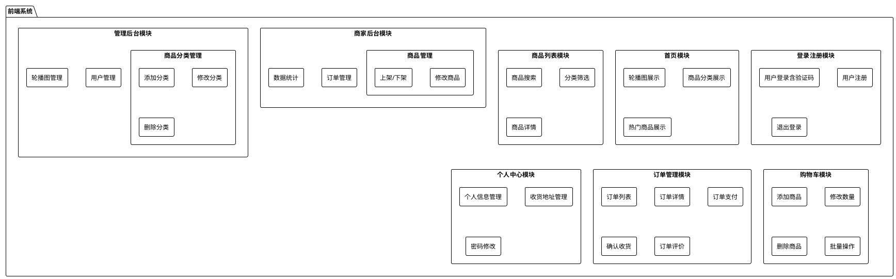
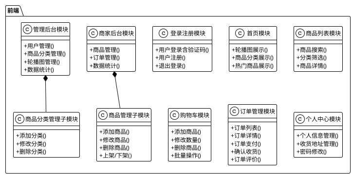

# UML前端框架图代码

## PlantUML 包图格式（推荐）

```plantuml
@startuml 前端框架图
!theme plain
skinparam packageStyle rectangle
skinparam defaultFontName "Microsoft YaHei"
skinparam defaultFontSize 12
skinparam package {
    BackgroundColor #E8F4F8
    BorderColor #409EFF
    BorderThickness 2
}

package "前端" {
    package "登录注册" {
        [用户登录含验证码]
        [用户注册]
        [退出登录]
    }
    
    package "首页" {
        [轮播图展示]
        [商品分类展示]
        [热门商品展示]
    }
    
    package "商品列表" {
        [商品搜索]
        [分类筛选]
        [商品详情]
    }
    
    package "购物车" {
        [添加商品]
        [修改数量]
        [删除商品]
        [批量操作]
    }
    
    package "订单管理" {
        [订单列表]
        [订单详情]
        [订单支付]
        [确认收货]
        [订单评价]
    }
    
    package "个人中心" {
        [个人信息管理]
        [收货地址管理]
        [密码修改]
    }
    
    package "商家后台" {
        package "商品管理" {
            [添加商品]
            [修改商品]
            [删除商品]
            [上架/下架]
        }
        [订单管理]
        [数据统计]
    }
    
    package "管理后台" {
        [用户管理]
        package "商品分类管理" {
            [添加分类]
            [修改分类]
            [删除分类]
        }
        [轮播图管理]
        [数据统计]
    }
}
@enduml
```

## PlantUML 组件图格式



## PlantUML 类图格式（模块关系）



## 使用说明

### 在线使用
1. 访问 http://www.plantuml.com/plantuml/uml/
2. 将代码复制粘贴到编辑器中
3. 点击"Submit"即可生成图片

### VS Code插件
1. 安装 "PlantUML" 插件
2. 创建 `.puml` 文件
3. 粘贴代码后按 `Alt+D` 预览

### 本地工具
1. 下载 PlantUML jar 包
2. 安装 Java 环境
3. 使用命令生成图片：
```bash
java -jar plantuml.jar 文件名.puml
```

### 推荐格式
- **包图（Package Diagram）**：最适合展示模块层次结构，已更新到系统设计文档中
- **组件图（Component Diagram）**：适合展示系统组件关系
- **类图（Class Diagram）**：适合展示模块的方法和关系


