# 前端框架图代码

## 1. Mermaid 格式（推荐，支持Markdown渲染）



## 2. Mermaid 树形图格式（更美观）

```mermaid
graph TB
    Root[前端] --> Login[登录注册]
    Root --> Home[首页]
    Root --> Product[商品列表]
    Root --> Cart[购物车]
    Root --> Order[订单管理]
    Root --> Profile[个人中心]
    Root --> Merchant[商家后台]
    Root --> Admin[管理后台]
    
    Login --> Login1[用户登录含验证码]
    Login --> Login2[用户注册]
    Login --> Login3[退出登录]
    
    Home --> Home1[轮播图展示]
    Home --> Home2[商品分类展示]
    Home --> Home3[热门商品展示]
    
    Product --> Product1[商品搜索]
    Product --> Product2[分类筛选]
    Product --> Product3[商品详情]
    
    Cart --> Cart1[添加商品]
    Cart --> Cart2[修改数量]
    Cart --> Cart3[删除商品]
    Cart --> Cart4[批量操作]
    
    Order --> Order1[订单列表]
    Order --> Order2[订单详情]
    Order --> Order3[订单支付]
    Order --> Order4[确认收货]
    Order --> Order5[订单评价]
    
    Profile --> Profile1[个人信息管理]
    Profile --> Profile2[收货地址管理]
    Profile --> Profile3[密码修改]
    
    Merchant --> Merchant1[商品管理]
    Merchant --> Merchant2[订单管理]
    Merchant --> Merchant3[数据统计]
    
    Merchant1 --> M1_1[添加商品]
    Merchant1 --> M1_2[修改商品]
    Merchant1 --> M1_3[删除商品]
    Merchant1 --> M1_4[上架/下架]
    
    Admin --> Admin1[用户管理]
    Admin --> Admin2[商品分类管理]
    Admin --> Admin3[轮播图管理]
    Admin --> Admin4[数据统计]
    
    Admin2 --> A2_1[添加分类]
    Admin2 --> A2_2[修改分类]
    Admin2 --> A2_3[删除分类]
```


## 3. Graphviz DOT 格式

```dot
digraph FrontendFramework {
    rankdir=TB;
    node [shape=box, style=rounded];
    
    Root [label="前端"];
    
    Root -> Login [label=""];
    Root -> Home [label=""];
    Root -> Product [label=""];
    Root -> Cart [label=""];
    Root -> Order [label=""];
    Root -> Profile [label=""];
    Root -> Merchant [label=""];
    Root -> Admin [label=""];
    
    Login [label="登录注册"];
    Login -> Login1 [label=""];
    Login -> Login2 [label=""];
    Login -> Login3 [label=""];
    Login1 [label="用户登录含验证码"];
    Login2 [label="用户注册"];
    Login3 [label="退出登录"];
    
    Home [label="首页"];
    Home -> Home1 [label=""];
    Home -> Home2 [label=""];
    Home -> Home3 [label=""];
    Home1 [label="轮播图展示"];
    Home2 [label="商品分类展示"];
    Home3 [label="热门商品展示"];
    
    Product [label="商品列表"];
    Product -> Product1 [label=""];
    Product -> Product2 [label=""];
    Product -> Product3 [label=""];
    Product1 [label="商品搜索"];
    Product2 [label="分类筛选"];
    Product3 [label="商品详情"];
    
    Cart [label="购物车"];
    Cart -> Cart1 [label=""];
    Cart -> Cart2 [label=""];
    Cart -> Cart3 [label=""];
    Cart -> Cart4 [label=""];
    Cart1 [label="添加商品"];
    Cart2 [label="修改数量"];
    Cart3 [label="删除商品"];
    Cart4 [label="批量操作"];
    
    Order [label="订单管理"];
    Order -> Order1 [label=""];
    Order -> Order2 [label=""];
    Order -> Order3 [label=""];
    Order -> Order4 [label=""];
    Order -> Order5 [label=""];
    Order1 [label="订单列表"];
    Order2 [label="订单详情"];
    Order3 [label="订单支付"];
    Order4 [label="确认收货"];
    Order5 [label="订单评价"];
    
    Profile [label="个人中心"];
    Profile -> Profile1 [label=""];
    Profile -> Profile2 [label=""];
    Profile -> Profile3 [label=""];
    Profile1 [label="个人信息管理"];
    Profile2 [label="收货地址管理"];
    Profile3 [label="密码修改"];
    
    Merchant [label="商家后台"];
    Merchant -> Merchant1 [label=""];
    Merchant -> Merchant2 [label=""];
    Merchant -> Merchant3 [label=""];
    Merchant1 [label="商品管理"];
    Merchant2 [label="订单管理"];
    Merchant3 [label="数据统计"];
    
    Merchant1 -> M1_1 [label=""];
    Merchant1 -> M1_2 [label=""];
    Merchant1 -> M1_3 [label=""];
    Merchant1 -> M1_4 [label=""];
    M1_1 [label="添加商品"];
    M1_2 [label="修改商品"];
    M1_3 [label="删除商品"];
    M1_4 [label="上架/下架"];
    
    Admin [label="管理后台"];
    Admin -> Admin1 [label=""];
    Admin -> Admin2 [label=""];
    Admin -> Admin3 [label=""];
    Admin -> Admin4 [label=""];
    Admin1 [label="用户管理"];
    Admin2 [label="商品分类管理"];
    Admin3 [label="轮播图管理"];
    Admin4 [label="数据统计"];
    
    Admin2 -> A2_1 [label=""];
    Admin2 -> A2_2 [label=""];
    Admin2 -> A2_3 [label=""];
    A2_1 [label="添加分类"];
    A2_2 [label="修改分类"];
    A2_3 [label="删除分类"];
}
```



## 4. PlantUML 格式

```plantuml
@startuml 前端框架图
!theme plain
skinparam defaultFontName "Microsoft YaHei"
skinparam defaultFontSize 12

package "前端" {
    package "登录注册" {
        [用户登录含验证码]
        [用户注册]
        [退出登录]
    }
    
    package "首页" {
        [轮播图展示]
        [商品分类展示]
        [热门商品展示]
    }
    
    package "商品列表" {
        [商品搜索]
        [分类筛选]
        [商品详情]
    }
    
    package "购物车" {
        [添加商品]
        [修改数量]
        [删除商品]
        [批量操作]
    }
    
    package "订单管理" {
        [订单列表]
        [订单详情]
        [订单支付]
        [确认收货]
        [订单评价]
    }
    
    package "个人中心" {
        [个人信息管理]
        [收货地址管理]
        [密码修改]
    }
    
    package "商家后台" {
        package "商品管理" {
            [添加商品]
            [修改商品]
            [删除商品]
            [上架/下架]
        }
        [订单管理]
        [数据统计]
    }
    
    package "管理后台" {
        [用户管理]
        package "商品分类管理" {
            [添加分类]
            [修改分类]
            [删除分类]
        }
        [轮播图管理]
        [数据统计]
    }
}
@enduml
```

## 5. HTML + CSS + JavaScript 可视化代码

```html
<!DOCTYPE html>
<html lang="zh-CN">
<head>
    <meta charset="UTF-8">
    <meta name="viewport" content="width=device-width, initial-scale=1.0">
    <title>前端框架图</title>
    <style>
        * {
            margin: 0;
            padding: 0;
            box-sizing: border-box;
        }
        
        body {
            font-family: "Microsoft YaHei", Arial, sans-serif;
            padding: 20px;
            background: #f5f5f5;
        }
        
        .tree {
            display: flex;
            flex-direction: column;
            align-items: center;
        }
        
        .node {
            background: white;
            border: 2px solid #409eff;
            border-radius: 8px;
            padding: 10px 20px;
            margin: 5px;
            min-width: 120px;
            text-align: center;
            box-shadow: 0 2px 4px rgba(0,0,0,0.1);
            transition: all 0.3s;
        }
        
        .node:hover {
            background: #ecf5ff;
            transform: translateY(-2px);
            box-shadow: 0 4px 8px rgba(0,0,0,0.15);
        }
        
        .root {
            background: #409eff;
            color: white;
            font-weight: bold;
            font-size: 18px;
        }
        
        .level1 {
            display: flex;
            flex-wrap: wrap;
            justify-content: center;
            margin-top: 20px;
        }
        
        .level2 {
            display: flex;
            flex-direction: column;
            align-items: center;
            margin: 10px;
        }
        
        .level3 {
            display: flex;
            flex-wrap: wrap;
            justify-content: center;
            margin-top: 10px;
        }
        
        .connector {
            width: 2px;
            height: 20px;
            background: #409eff;
            margin: 0 auto;
        }
        
        .branch {
            display: flex;
            flex-direction: column;
            align-items: center;
            margin: 10px;
        }
    </style>
</head>
<body>
    <div class="tree">
        <div class="node root">前端</div>
        <div class="connector"></div>
        
        <div class="level1">
            <div class="branch">
                <div class="node">登录注册</div>
                <div class="connector"></div>
                <div class="level3">
                    <div class="node">用户登录含验证码</div>
                    <div class="node">用户注册</div>
                    <div class="node">退出登录</div>
                </div>
            </div>
            
            <div class="branch">
                <div class="node">首页</div>
                <div class="connector"></div>
                <div class="level3">
                    <div class="node">轮播图展示</div>
                    <div class="node">商品分类展示</div>
                    <div class="node">热门商品展示</div>
                </div>
            </div>
            
            <div class="branch">
                <div class="node">商品列表</div>
                <div class="connector"></div>
                <div class="level3">
                    <div class="node">商品搜索</div>
                    <div class="node">分类筛选</div>
                    <div class="node">商品详情</div>
                </div>
            </div>
            
            <div class="branch">
                <div class="node">购物车</div>
                <div class="connector"></div>
                <div class="level3">
                    <div class="node">添加商品</div>
                    <div class="node">修改数量</div>
                    <div class="node">删除商品</div>
                    <div class="node">批量操作</div>
                </div>
            </div>
            
            <div class="branch">
                <div class="node">订单管理</div>
                <div class="connector"></div>
                <div class="level3">
                    <div class="node">订单列表</div>
                    <div class="node">订单详情</div>
                    <div class="node">订单支付</div>
                    <div class="node">确认收货</div>
                    <div class="node">订单评价</div>
                </div>
            </div>
            
            <div class="branch">
                <div class="node">个人中心</div>
                <div class="connector"></div>
                <div class="level3">
                    <div class="node">个人信息管理</div>
                    <div class="node">收货地址管理</div>
                    <div class="node">密码修改</div>
                </div>
            </div>
            
            <div class="branch">
                <div class="node">商家后台</div>
                <div class="connector"></div>
                <div class="level3">
                    <div class="branch">
                        <div class="node">商品管理</div>
                        <div class="connector"></div>
                        <div class="level3">
                            <div class="node">添加商品</div>
                            <div class="node">修改商品</div>
                            <div class="node">删除商品</div>
                            <div class="node">上架/下架</div>
                        </div>
                    </div>
                    <div class="node">订单管理</div>
                    <div class="node">数据统计</div>
                </div>
            </div>
            
            <div class="branch">
                <div class="node">管理后台</div>
                <div class="connector"></div>
                <div class="level3">
                    <div class="node">用户管理</div>
                    <div class="branch">
                        <div class="node">商品分类管理</div>
                        <div class="connector"></div>
                        <div class="level3">
                            <div class="node">添加分类</div>
                            <div class="node">修改分类</div>
                            <div class="node">删除分类</div>
                        </div>
                    </div>
                    <div class="node">轮播图管理</div>
                    <div class="node">数据统计</div>
                </div>
            </div>
        </div>
    </div>
</body>
</html>
```

## 使用说明

1. **Mermaid格式**：可以直接在支持Mermaid的Markdown编辑器（如Typora、VS Code的Markdown Preview Enhanced插件）中使用，也可以在线渲染。

2. **Graphviz DOT格式**：需要使用Graphviz工具渲染，可以在线使用 https://dreampuf.github.io/GraphvizOnline/ 或安装Graphviz本地工具。

3. **PlantUML格式**：需要在支持PlantUML的工具中使用，如VS Code的PlantUML插件，或在线使用 http://www.plantuml.com/plantuml/uml/

4. **HTML格式**：可以直接在浏览器中打开查看，适合演示和展示。

## 推荐使用

对于文档编写，**推荐使用Mermaid格式**，因为：
- 大多数Markdown编辑器都支持
- 代码简洁易读
- 渲染效果美观
- 易于维护和修改


