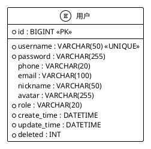
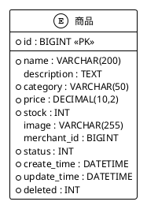
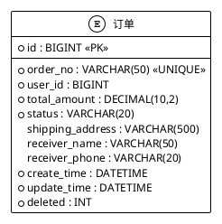
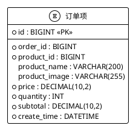
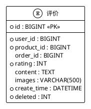
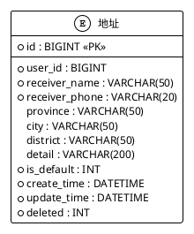
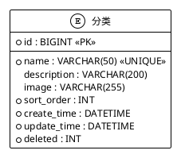
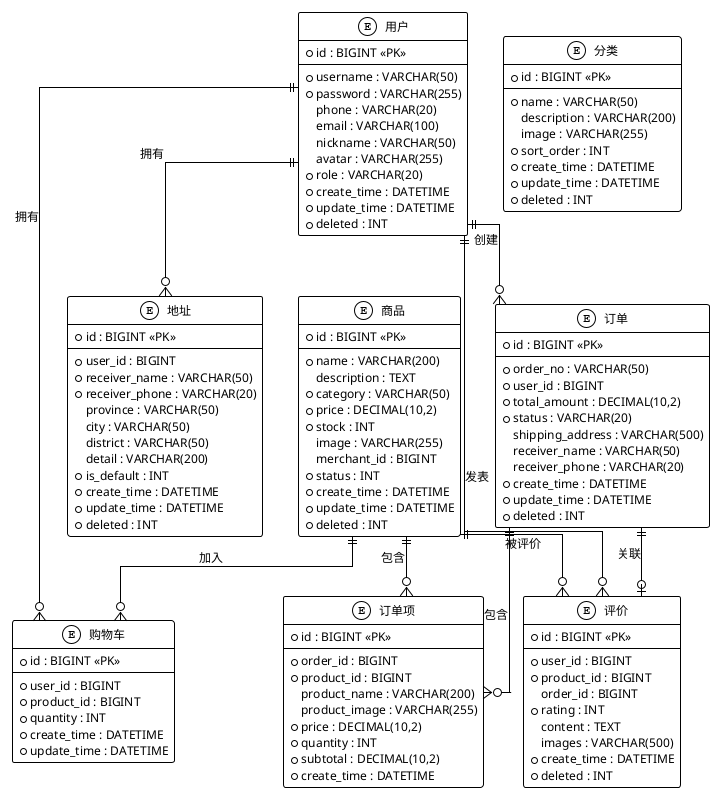

## 4.2 数据库设计

### 4.2.1 数据库结构设计

(1) **用户实体图**

存储用户基本信息，如用户ID、用户名、密码、联系方式、角色、头像等。实体图如图4.2所示：

**图4.2 用户信息表实体图**

(2) **商品实体图**

存储商品信息，如商品ID、名称、价格、库存、分类、图片、描述、商家ID、状态等。实体图如图4.3所示：

**图4.3 商品信息表实体图**

(3) **订单实体图**

存储订单信息，如订单ID、订单号、用户ID、下单时间、总价、状态、收货地址、收货人信息等。实体图如图4.4所示：

**图4.4 订单信息表实体图**

(4) **订单项实体图**

存储订单项信息，如订单项ID、订单ID、商品ID、商品名称、商品图片、单价、数量、小计等。实体图如图4.5所示：

**图4.5 订单项信息表实体图**

(5) **购物车实体图**

存储购物车信息，如购物车ID、用户ID、商品ID、数量等。实体图如图4.6所示：

**图4.6 购物车信息表实体图**

```plantuml
@startuml 购物车实体图
!theme plain
skinparam defaultFontName "Microsoft YaHei"
skinparam defaultFontSize 12

entity "购物车" as shopping_cart {
    * id : BIGINT <<PK>>
    --
    * user_id : BIGINT
    * product_id : BIGINT
    * quantity : INT
    * create_time : DATETIME
    * update_time : DATETIME
}

@enduml
```

(6) **评价实体图**

存储商品评价信息，如评价ID、用户ID、商品ID、订单ID、评分、评价内容、评价图片等。实体图如图4.7所示：

**图4.7 评价信息表实体图**

(7) **地址实体图**

存储收货地址信息，如地址ID、用户ID、收货人姓名、收货人电话、省市区、详细地址、是否默认等。实体图如图4.8所示：

**图4.8 地址信息表实体图**

(8) **分类实体图**

存储商品分类信息，如分类ID、分类名称、分类描述、分类图片、排序顺序等。实体图如图4.9所示：

**图4.9 分类信息表实体图**

### 4.2.2 数据库关系图

系统各实体之间的关系图如图4.10所示：

**图4.10 数据库ER关系图**

### 4.2.3 数据库表说明

**用户表(users)**: 存储系统所有用户的基本信息，包括普通用户、商家和管理员。通过role字段区分用户角色。

**商品表(products)**: 存储平台所有商品的信息，包括商品名称、描述、价格、库存、图片等。通过merchant_id关联商家，通过status字段控制商品上架状态。

**订单表(orders)**: 存储用户订单的主要信息，包括订单号、用户ID、总金额、订单状态、收货地址等。订单状态包括待支付、已支付、已发货、已完成、已取消。

**订单项表(order_items)**: 存储订单中每个商品的详细信息，包括商品ID、商品名称、单价、数量、小计等。一个订单可以包含多个订单项。

**购物车表(shopping_cart)**: 存储用户购物车中的商品信息，每个用户对每个商品只能有一条购物车记录，通过唯一索引保证。

**评价表(evaluations)**: 存储用户对商品的评价信息，包括评分、评价内容、评价图片等。通过order_id关联订单，确保评价的真实性。

**地址表(addresses)**: 存储用户的收货地址信息，用户可以添加多个地址，通过is_default字段标识默认地址。

**分类表(categories)**: 存储商品分类信息，用于商品的分类展示和管理。通过sort_order字段控制分类的显示顺序。

