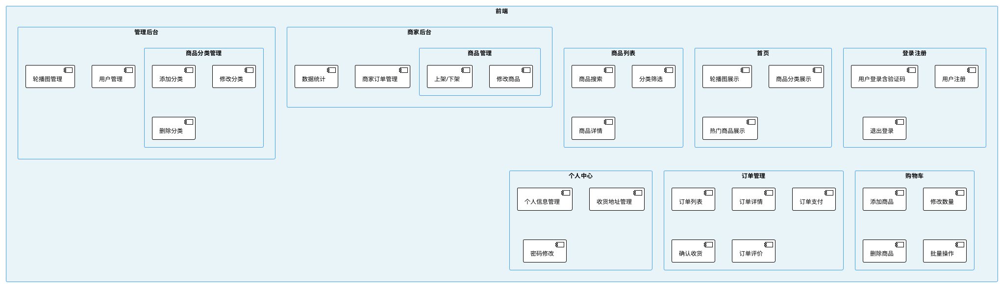
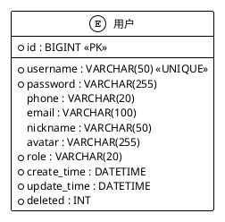
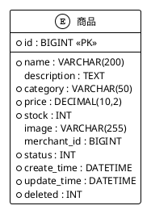
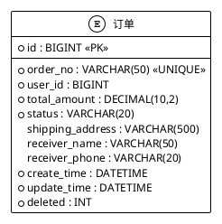
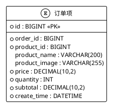
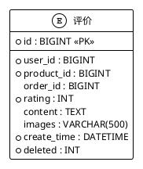
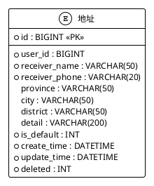
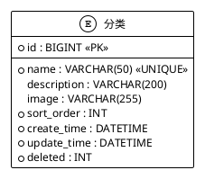
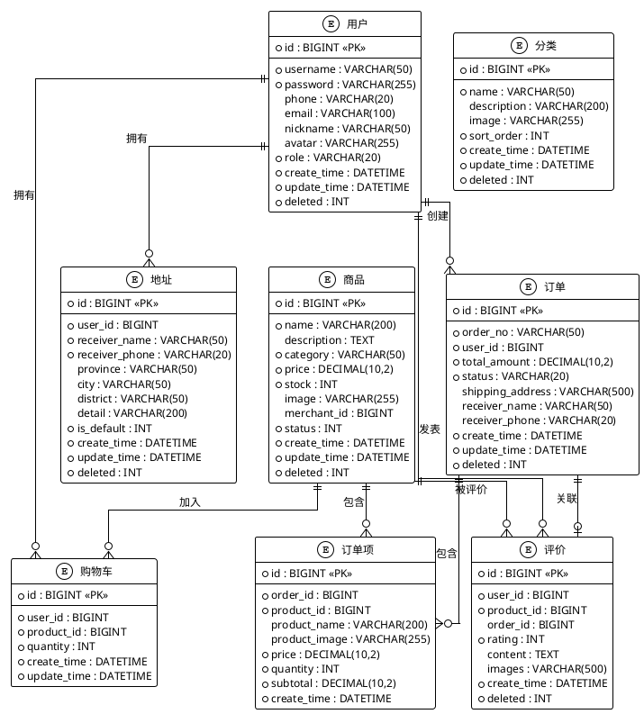

## 4 系统设计

基于Spring Boot和Vue3平台的特色农产品销售平台的设计与实现，包括商品浏览、商品搜索、购物车、订单管理、个人中心等关键功能点部分的代码实现。

### 4.1 功能模块设计

本系统一共分为前端和后台两大模块，因为实现前端和后台通常使用的是前后端分离的模式，因此虽然两个模块看起来是独立的模块，但因为都是使用了同一个数据库的原因，两者的关系其实十分的密切。下面为两大模块分析细化后出现的功能。

#### 4.1.1 前端功能模块设计

前端的功能主要分为：

(1) **用户注册与登录模块**

实现用户的注册、登录、注销等功能。注册时对用户名唯一性进行校验，密码采用BCrypt加密存储。登录时校验用户名、密码和图片验证码，登录成功后将用户信息存入JWT Token中，实现无状态认证。系统支持三种角色：普通用户、商家、管理员，不同角色登录后拥有不同的权限和功能入口。

(2) **商品浏览与搜索模块**

展示所有农产品信息，支持分类、搜索、筛选等功能。商品信息通过Axios从后端RESTful API获取，支持分页、分类筛选和关键词搜索。首页采用轮播图展示热门商品和促销活动，商品列表采用卡片式布局展示商品的关键信息，包括商品图片、名称、价格、库存状态等。点击商品卡片可以进入商品详情页面，查看完整的商品信息、高清图片、用户评价等。

(3) **购物车模块**

实现商品的添加、修改、删除、批量选择等功能。购物车页面以表格形式展示已选商品的信息，支持修改商品数量，系统会自动校验库存是否充足。用户可以批量选择商品，支持全选和反选操作，也可以对购物车中的商品进行单个删除和批量删除。购物车页面实时计算选中商品的总金额，用户可以随时查看购物车中的商品总价，确认后可以跳转到订单结算页面。

(4) **订单管理模块**

展示用户订单信息，支持支付、取消、确认收货、评价等操作。订单列表支持按订单状态筛选，包括"待支付"、"已支付"、"已发货"、"已完成"等状态。用户可以查看订单详情，包括订单商品信息、收货地址、订单金额等。对于待支付的订单，用户可以完成支付操作；对于已发货的订单，用户可以确认收货；对于已完成的订单，用户可以对订单中的商品进行评价。

(5) **用户信息管理模块**

实现用户信息的查看与修改。用户可在个人中心修改昵称、联系方式、头像等信息。系统支持收货地址管理，用户可以添加、编辑、删除收货地址，支持设置默认地址。用户可以修改登录密码，系统采用BCrypt加密算法对密码进行加密存储。系统还提供了头像上传功能，支持图片上传到阿里云OSS对象存储服务。框架如图4.1所示。

(6) **商品管理模块（商家）**

商家可以在商家后台管理自己上架的商品，包括商品的添加、编辑、删除、上架、下架等操作。商品管理页面支持按分类、状态等条件筛选商品，支持商品信息的批量操作。商家可以上传商品图片，填写商品名称、描述、分类、价格、库存等详细信息。

(7) **商品分类管理模块（管理员）**

管理员可以在管理后台管理商品分类，包括分类的添加、编辑、删除等操作。分类管理页面支持搜索功能，管理员可以快速检索和定位目标分类。所有分类信息以列表形式展示，支持分类信息的实时更新。

(8) **轮播图管理模块（管理员）**

管理员可以在管理后台管理首页轮播图，包括轮播图的添加、编辑、删除等操作。管理员可以上传轮播图图片，填写标题和描述信息，设置关联的商品分类，用户点击轮播图时可以快速跳转到对应分类的商品列表。

(9) **用户管理模块（管理员）**

管理员可以在管理后台查看和管理平台所有注册用户，包括用户信息的查看、角色修改、用户禁用等操作。系统支持按角色筛选用户，可以分别查看普通用户、商家和管理员。管理员可以查看用户的详细信息，包括联系方式、注册时间等。

(10) **商品评价模块**

用户完成订单并确认收货后，可以对订单中的商品进行评价。评价功能支持星级评分（1-5星）、文字评价和图片评价。所有评价信息会在商品详情页面的"用户评价"标签页中展示，帮助其他用户做出更明智的购买决策。

**图4.1 前端框架图**

#### 4.1.2 后端功能模块设计

后端的功能主要分为：

(1) **用户管理模块**

负责用户的注册、登录、信息修改、权限校验等。通过AuthController提供用户注册、登录接口，登录时验证图片验证码，登录成功后生成JWT Token。通过UserController提供用户信息查询、修改等接口。系统采用Spring Security进行权限控制，支持基于角色的访问控制（RBAC），不同角色拥有不同的权限。

(2) **商品管理模块**

实现商品的增删改查、图片上传、分类管理等功能。管理员和商家通过ProductController实现商品的增删改查操作，支持图片上传和分类管理。商品信息包括商品名称、描述、分类、价格、库存、商品图片等。系统支持商品的上架和下架操作，下架的商品不会在前台展示。

(3) **订单管理模块**

实现订单的创建、查询、修改、删除、状态管理等功能。OrderController提供订单的创建、查询、修改、删除等接口。订单创建时支持从购物车创建和直接购买两种模式。订单状态包括"待支付"、"已支付"、"已发货"、"已完成"等，系统支持订单状态的流转和跟踪。

(4) **分类管理模块**

实现商品分类的增删改查，便于商品的分类展示和管理。CategoryController实现商品分类的增删改查功能。分类信息包括分类名称、分类图标、排序权重等。系统支持分类的搜索功能，管理员可以快速检索和定位目标分类。

(5) **购物车管理模块**

实现购物车商品的添加、修改、删除、查询等功能。ShoppingCartController提供购物车相关的接口，支持商品的添加、数量修改、删除等操作。购物车数据与用户关联，用户登录后可以查看和管理自己的购物车。

(6) **地址管理模块**

实现收货地址的增删改查功能。AddressController提供地址相关的接口，用户可以添加、编辑、删除收货地址，支持设置默认地址。地址信息包括收货人姓名、联系电话、省市区、详细地址等。

(7) **评价管理模块**

实现商品评价的创建、查询等功能。EvaluationController提供评价相关的接口，用户可以创建评价，包括星级评分、文字评价和图片评价。系统支持查询商品的评价列表，帮助其他用户了解商品质量。

(8) **轮播图管理模块**

实现轮播图的增删改查功能。BannerController和AdminBannerController提供轮播图相关的接口，管理员可以添加、编辑、删除轮播图。轮播图信息包括标题、描述、图片地址、关联分类等。

(9) **文件上传模块**

实现图片上传功能，支持上传到阿里云OSS对象存储服务。FileUploadController提供文件上传接口，支持商品图片、用户头像、评价图片等文件的上传。系统对上传的文件进行格式和大小校验，确保上传文件的安全性。

(10) **验证码模块**

实现图片验证码的生成和验证功能。CaptchaService提供验证码生成和验证服务，验证码采用随机生成的字母数字组合，有效防止恶意登录和暴力破解。验证码采用一次性使用机制，验证后自动删除，有效期为5分钟。

### 4.2 数据库设计

#### 4.2.1 数据库结构设计

(1) **用户实体图**

存储用户基本信息，如用户ID、用户名、密码、联系方式、角色、头像等。实体图如图4.2所示：

**图4.2 用户信息表实体图**

(2) **商品实体图**

存储商品信息，如商品ID、名称、价格、库存、分类、图片、描述、商家ID、状态等。实体图如图4.3所示：

**图4.3 商品信息表实体图**

(3) **订单实体图**

存储订单信息，如订单ID、订单号、用户ID、下单时间、总价、状态、收货地址、收货人信息等。实体图如图4.4所示：

**图4.4 订单信息表实体图**

(4) **订单项实体图**

存储订单项信息，如订单项ID、订单ID、商品ID、商品名称、商品图片、单价、数量、小计等。实体图如图4.5所示：

**图4.5 订单项信息表实体图**

(5) **购物车实体图**

存储购物车信息，如购物车ID、用户ID、商品ID、数量等。实体图如图4.6所示：

**图4.6 购物车信息表实体图**

```plantuml
@startuml 购物车实体图
!theme plain
skinparam defaultFontName "Microsoft YaHei"
skinparam defaultFontSize 12

entity "购物车" as shopping_cart {
    * id : BIGINT <<PK>>
    --
    * user_id : BIGINT
    * product_id : BIGINT
    * quantity : INT
    * create_time : DATETIME
    * update_time : DATETIME
}

@enduml
```

(6) **评价实体图**

存储商品评价信息，如评价ID、用户ID、商品ID、订单ID、评分、评价内容、评价图片等。实体图如图4.7所示：

**图4.7 评价信息表实体图**

(7) **地址实体图**

存储收货地址信息，如地址ID、用户ID、收货人姓名、收货人电话、省市区、详细地址、是否默认等。实体图如图4.8所示：

**图4.8 地址信息表实体图**

(8) **分类实体图**

存储商品分类信息，如分类ID、分类名称、分类描述、分类图片、排序顺序等。实体图如图4.9所示：

**图4.9 分类信息表实体图**

#### 4.2.2 数据库关系图

系统各实体之间的关系图如图4.10所示：

**图4.10 数据库ER关系图**

#### 4.2.3 数据库表说明

**用户表(users)**: 存储系统所有用户的基本信息，包括普通用户、商家和管理员。通过role字段区分用户角色。

**商品表(products)**: 存储平台所有商品的信息，包括商品名称、描述、价格、库存、图片等。通过merchant_id关联商家，通过status字段控制商品上架状态。

**订单表(orders)**: 存储用户订单的主要信息，包括订单号、用户ID、总金额、订单状态、收货地址等。订单状态包括待支付、已支付、已发货、已完成、已取消。

**订单项表(order_items)**: 存储订单中每个商品的详细信息，包括商品ID、商品名称、单价、数量、小计等。一个订单可以包含多个订单项。

**购物车表(shopping_cart)**: 存储用户购物车中的商品信息，每个用户对每个商品只能有一条购物车记录，通过唯一索引保证。

**评价表(evaluations)**: 存储用户对商品的评价信息，包括评分、评价内容、评价图片等。通过order_id关联订单，确保评价的真实性。

**地址表(addresses)**: 存储用户的收货地址信息，用户可以添加多个地址，通过is_default字段标识默认地址。

**分类表(categories)**: 存储商品分类信息，用于商品的分类展示和管理。通过sort_order字段控制分类的显示顺序。

#### 4.2.4 数据库表字段说明（PPT 展示用）

下表按照“字段名称 + 字段含义”的形式，对系统中的主要数据表进行汇总，方便在 PPT 中展示。

##### （1）用户信息表（`users`）

| 字段名称       | 字段含义                                      |
| -------------- | --------------------------------------------- |
| `id`           | 唯一标识，主键                               |
| `username`     | 用户名（唯一）                               |
| `password`     | 登录密码（BCrypt 加密存储）                  |
| `phone`        | 手机号                                       |
| `email`        | 邮箱                                         |
| `nickname`     | 昵称                                         |
| `avatar`       | 头像 URL                                     |
| `role`         | 角色：`USER` 普通用户，`MERCHANT` 商家，`ADMIN` 管理员 |
| `create_time`  | 创建时间                                     |
| `update_time`  | 更新时间                                     |
| `deleted`      | 删除标记：0-未删除，1-已删除                 |

##### （2）商品信息表（`products`）

| 字段名称         | 字段含义                                                |
| ---------------- | ------------------------------------------------------- |
| `id`             | 唯一标识，主键                                         |
| `name`           | 商品名称                                               |
| `description`    | 商品描述                                               |
| `category`       | 商品分类名称（与分类表对应）                           |
| `price`          | 商品价格（单位：元，保留两位小数）                     |
| `stock`          | 库存数量                                               |
| `image`          | 商品主图 URL                                           |
| `specifications` | 商品参数信息（JSON 格式）                              |
| `detail_images`  | 详情图片 URL 集合（多个 URL，逗号分隔）                |
| `detail_text`    | 图文详情（富文本描述）                                 |
| `merchant_id`    | 商家 ID，对应商家用户                                  |
| `status`         | 状态：0-下架，1-上架                                   |
| `create_time`    | 创建时间                                               |
| `update_time`    | 更新时间                                               |
| `deleted`        | 删除标记：0-未删除，1-已删除                           |

##### （3）订单信息表（`orders`）

| 字段名称          | 字段含义                                                                 |
| ----------------- | ------------------------------------------------------------------------ |
| `id`              | 唯一标识，主键                                                          |
| `order_no`        | 订单号（唯一）                                                          |
| `user_id`         | 用户 ID，对应 `users.id`                                                |
| `total_amount`    | 订单总金额                                                              |
| `status`          | 订单状态：`PENDING_PAYMENT` 待支付、`PAID` 已支付、`SHIPPED` 已发货、`COMPLETED` 已完成、`CANCELLED` 已取消 |
| `shipping_address`| 收货地址全文                                                            |
| `receiver_name`   | 收货人姓名                                                              |
| `receiver_phone`  | 收货人电话                                                              |
| `create_time`     | 创建时间                                                                |
| `update_time`     | 更新时间                                                                |
| `deleted`         | 删除标记：0-未删除，1-已删除                                            |

##### （4）订单项信息表（`order_items`）

| 字段名称        | 字段含义                         |
| --------------- | -------------------------------- |
| `id`            | 唯一标识，主键                  |
| `order_id`      | 订单 ID，对应 `orders.id`       |
| `product_id`    | 商品 ID，对应 `products.id`     |
| `product_name`  | 下单时的商品名称快照            |
| `product_image` | 下单时的商品图片 URL 快照       |
| `price`         | 商品单价                         |
| `quantity`      | 购买数量                         |
| `subtotal`      | 小计金额（单价 × 数量）         |
| `create_time`   | 创建时间                         |

##### （5）购物车信息表（`shopping_cart`）

| 字段名称       | 字段含义                          |
| -------------- | --------------------------------- |
| `id`           | 唯一标识，主键                   |
| `user_id`      | 用户 ID，对应 `users.id`         |
| `product_id`   | 商品 ID，对应 `products.id`      |
| `quantity`     | 购物车中该商品数量               |
| `create_time`  | 加入购物车时间                   |
| `update_time`  | 最近一次更新时间                 |

##### （6）评价信息表（`evaluations`）

| 字段名称      | 字段含义                                   |
| ------------- | ------------------------------------------ |
| `id`          | 唯一标识，主键                            |
| `user_id`     | 用户 ID，对应 `users.id`                  |
| `product_id`  | 商品 ID，对应 `products.id`               |
| `order_id`    | 订单 ID，对应 `orders.id`（可选）         |
| `rating`      | 评分：1–5 星                              |
| `content`     | 评价内容文本                              |
| `images`      | 评价图片 URL 集合（多个 URL，逗号分隔）   |
| `create_time` | 创建时间                                  |
| `deleted`     | 删除标记：0-未删除，1-已删除              |

##### （7）地址信息表（`addresses`）

| 字段名称        | 字段含义                          |
| --------------- | --------------------------------- |
| `id`            | 唯一标识，主键                   |
| `user_id`       | 用户 ID，对应 `users.id`         |
| `receiver_name` | 收货人姓名                       |
| `receiver_phone`| 收货人电话                       |
| `province`      | 省份                             |
| `city`          | 城市                             |
| `district`      | 区/县                            |
| `detail`        | 详细地址                         |
| `is_default`    | 是否默认地址：0-否，1-是         |
| `create_time`   | 创建时间                         |
| `update_time`   | 更新时间                         |
| `deleted`       | 删除标记：0-未删除，1-已删除     |

##### （8）分类信息表（`categories`）

| 字段名称      | 字段含义                          |
| ------------- | --------------------------------- |
| `id`          | 唯一标识，主键                   |
| `name`        | 分类名称（唯一）                 |
| `description` | 分类描述                         |
| `sort_order`  | 排序顺序（数字越小优先级越高）   |
| `create_time` | 创建时间                         |
| `update_time` | 更新时间                         |
| `deleted`     | 删除标记：0-未删除，1-已删除     |

##### （9）轮播图信息表（`banners`）

| 字段名称       | 字段含义                                       |
| -------------- | ---------------------------------------------- |
| `id`           | 唯一标识，主键                                |
| `image`        | 轮播图图片 URL                                |
| `category_name`| 分类名称（与分类管理中的分类名称对应）        |
| `sort_order`   | 排序顺序                                      |
| `status`       | 状态：0-禁用，1-启用                          |
| `create_time`  | 创建时间                                      |
| `update_time`  | 更新时间                                      |
| `deleted`      | 逻辑删除标记：0-未删除，1-已删除              |

##### （10）管理端商品详情扩展表（`admin_products`）

| 字段名称        | 字段含义                                  |
| --------------- | ----------------------------------------- |
| `product_id`    | 商品 ID，主键，对应 `products.id`        |
| `specifications`| 商品参数信息（JSON 或文本）              |
| `detail_images` | 详情图片 URL 集合（逗号分隔）            |
| `detail_text`   | 图文详情（富文本或纯文本）               |
| `create_time`   | 创建时间                                  |
| `update_time`   | 更新时间                                  |

## 5 系统实现

### 5.1 客户端功能

#### 5.1.1 产品浏览界面

产品浏览模块主要面向普通用户和商家，用于查看平台上的特色农产品信息。用户登录系统后，可以在首页和商品列表页面浏览后台维护的商品数据，系统按分类、价格等维度对商品进行展示。点击任意商品卡片，会跳转到商品详情页面，用户可以查看商品图片、价格、库存、参数信息以及其他用户的评价等详细内容，并可将商品加入购物车或直接下单购买。商家和管理员通过该界面能够直观地了解商品在前台的展示效果，便于后续进行商品信息的维护与优化，界面示例如图 5.1 所示。

#### 5.1.2 登录模块实现

后端通过 AuthController 提供用户注册、登录等接口，通过 UserController 提供用户信息修改等接口。注册时对用户名唯一性进行校验，密码采用 BCrypt 加密存储。登录时校验用户名、密码和图片验证码，登录成功后将用户信息生成 JWT Token 返回给前端，实现无状态认证。用户信息通过 UserService 进行业务处理，UserMapper 负责与数据库交互。效果图如图 5.2 所示。

#### 5.1.3 购物车模块

购物车模块主要面向普通用户，用于管理用户准备购买的商品。用户登录系统后，在商品浏览页面可以将感兴趣的商品添加到购物车，系统会自动保存用户的购物车数据。购物车页面以列表形式展示已添加的商品信息，包括商品图片、名称、价格、数量等，用户可以修改商品数量，系统会自动校验库存是否充足并实时计算商品小计。用户可以选择单个或多个商品进行批量操作，支持全选、反选、删除等功能。购物车页面实时计算选中商品的总金额，用户可以随时查看购物车中的商品总价，确认后可以跳转到订单结算页面完成下单。界面示例如图 5.3 所示。

#### 5.1.4 订单管理模块

订单管理模块主要面向普通用户和商家，用于查看和管理订单信息。用户登录系统后，可以在订单管理页面查看自己的所有订单记录，系统按订单状态对订单进行分类展示，包括"待支付"、"已支付"、"已发货"、"已完成"、"已取消"等状态。用户可以点击订单卡片查看订单详情，包括订单商品信息、收货地址、订单金额、订单状态等详细信息。对于待支付的订单，用户可以完成支付操作；对于已发货的订单，用户可以确认收货；对于已完成的订单，用户可以对订单中的商品进行评价。商家可以在商家后台查看和管理自己店铺的所有订单，支持订单状态的更新和订单信息的查询。界面示例如图 5.4 所示。

#### 5.1.5 用户信息管理模块

用户信息管理模块主要面向所有注册用户，用于管理个人账户信息和收货地址。用户登录系统后，可以在个人中心页面查看和修改个人信息，包括昵称、联系方式、邮箱、头像等基本信息。系统支持收货地址管理功能，用户可以添加、编辑、删除收货地址，支持设置默认地址，方便用户在结算时快速选择收货地址。用户可以修改登录密码，系统采用 BCrypt 加密算法对新密码进行加密存储，确保账户安全。系统还提供了头像上传功能，支持图片上传到阿里云 OSS 对象存储服务，用户可以自定义个人头像。界面示例如图 5.5 所示。

#### 5.1.6 商品管理模块（商家）

商品管理模块主要面向商家用户，用于管理商家自己上架的商品信息。商家登录系统后，可以在商家后台的商品管理页面查看自己店铺的所有商品，系统支持按分类、状态等条件筛选商品，方便商家快速定位目标商品。商家可以添加新商品，填写商品名称、描述、分类、价格、库存等详细信息，上传商品主图和详情图片。对于已上架的商品，商家可以编辑商品信息、修改商品价格和库存、上架或下架商品，也可以删除不需要的商品。商品管理页面以列表形式展示商品的关键信息，包括商品图片、名称、价格、库存、状态等，商家可以直观地了解商品的销售状态，便于后续进行商品信息的维护与优化。界面示例如图 5.6 所示。

#### 5.1.7 商品分类管理模块（管理员）

商品分类管理模块主要面向管理员用户，用于管理平台上的商品分类信息。管理员登录系统后，可以在管理后台的分类管理页面查看所有商品分类，系统以列表形式展示分类的关键信息，包括分类名称、分类描述、排序顺序等。管理员可以添加新分类，填写分类名称、描述等信息，设置分类的排序顺序，控制分类在前台的显示顺序。对于已存在的分类，管理员可以编辑分类信息、修改分类描述和排序顺序，也可以删除不需要的分类。分类管理页面支持搜索功能，管理员可以快速检索和定位目标分类，提高管理效率。所有分类信息的修改会实时同步到前台，用户在前台浏览商品时可以立即看到最新的分类信息。界面示例如图 5.7 所示。

#### 5.1.8 轮播图管理模块（管理员）

轮播图管理模块主要面向管理员用户，用于管理首页的轮播图展示内容。管理员登录系统后，可以在管理后台的轮播图管理页面查看所有轮播图，系统以列表形式展示轮播图的关键信息，包括轮播图图片、关联分类、排序顺序、状态等。管理员可以添加新轮播图，上传轮播图图片，设置关联的商品分类，用户点击轮播图时可以快速跳转到对应分类的商品列表。管理员可以设置轮播图的排序顺序，控制轮播图在首页的显示顺序，也可以启用或禁用轮播图，控制轮播图是否在前台展示。对于已存在的轮播图，管理员可以编辑轮播图信息、修改关联分类和排序顺序，也可以删除不需要的轮播图。轮播图管理页面支持按状态筛选轮播图，方便管理员快速查看启用或禁用的轮播图。界面示例如图 5.8 所示。

#### 5.1.9 用户管理模块（管理员）

用户管理模块主要面向管理员用户，用于查看和管理平台所有注册用户。管理员登录系统后，可以在管理后台的用户管理页面查看所有注册用户，系统以列表形式展示用户的关键信息，包括用户名、昵称、角色、联系方式、注册时间等。系统支持按角色筛选用户，管理员可以分别查看普通用户、商家和管理员，方便对不同类型用户进行管理。管理员可以查看用户的详细信息，包括联系方式、注册时间、账户状态等，也可以修改用户的角色，将普通用户升级为商家或将商家降级为普通用户。对于违规用户，管理员可以禁用用户账户，被禁用的用户将无法登录系统。用户管理页面支持搜索功能，管理员可以通过用户名或联系方式快速检索和定位目标用户，提高管理效率。界面示例如图 5.9 所示。

#### 5.1.10 商品评价模块

商品评价模块主要面向普通用户，用于对已购买的商品进行评价和查看其他用户的评价。用户完成订单并确认收货后，可以在订单详情页面对订单中的商品进行评价。评价功能支持星级评分（1-5星），用户可以根据商品质量、服务态度等方面进行综合评分。用户可以填写文字评价，描述商品的使用体验、优缺点等详细信息，也可以上传评价图片，展示商品的真实情况。所有评价信息会在商品详情页面的"用户评价"标签页中展示，其他用户在浏览商品时可以查看这些评价，了解商品的质量和用户满意度，帮助做出更明智的购买决策。评价模块支持按评分筛选评价，用户可以查看不同评分区间的评价内容，也可以查看带图片的评价，更直观地了解商品的实际情况。界面示例如图 5.10 所示。

